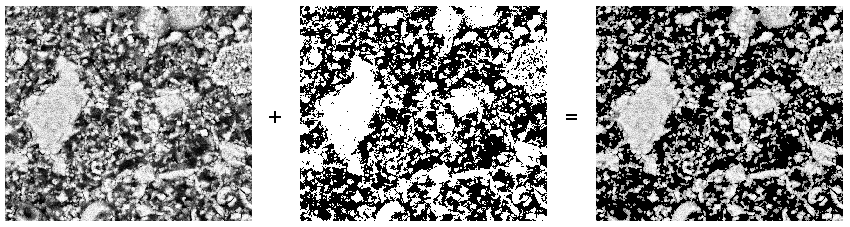
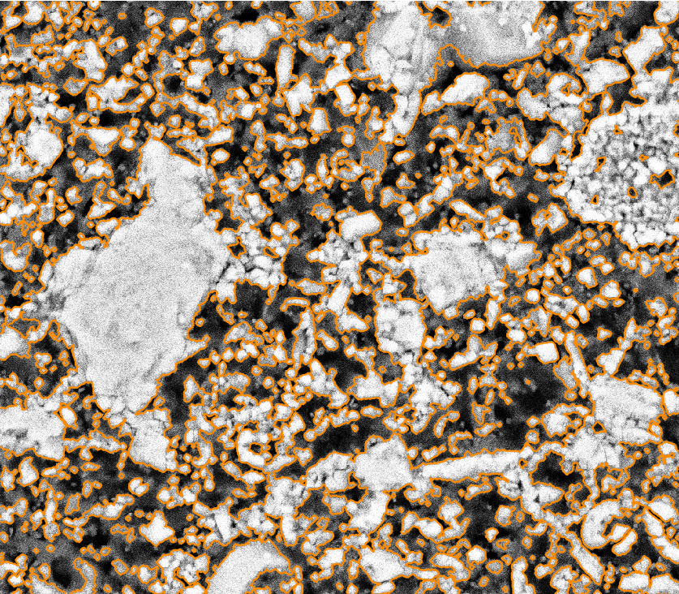
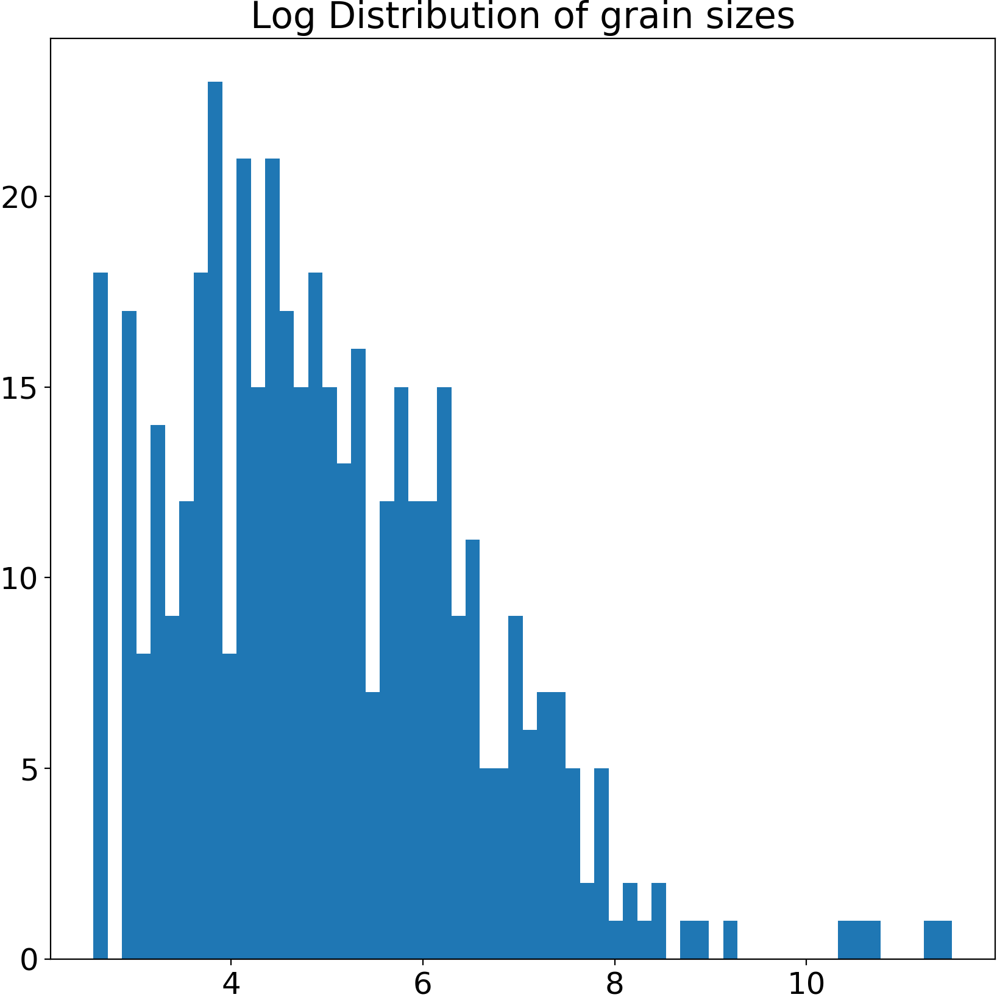

# Gaussian Mixture Models for Robust Unsupervised Scanning-Electron Microscopy Image Segmentation of North Sea Chalk

Here, we reproduce the research presented in:

> [Dramsch, J. S.](https://orcid.org/0000-0001-8273-905X), [Amour, F.](https://orcid.org/0000-0003-0242-6569), & [Lüthje, M.](https://orcid.org/0000-0003-2715-1653) (2018, November). Gaussian Mixture Models for Robust Unsupervised Scanning-Electron Microscopy Image Segmentation of North Sea Chalk. In First EAGE/PESGB Workshop Machine Learning.

We use Gaussian Mixture Models to find the optimal separation of chalk (oolites) in backscatter scanning-electron microscopy images. 

Then we apply morphological filtering to smoothe out the edges in the notebook [SEM Segmentation.ipynb](SEM%20Segmentation.ipynb)

We then perform granulometry on the perimeters of each grain in the notebook [SEM Granulometry.ipynb](SEM%20Granulometry.ipynb)

